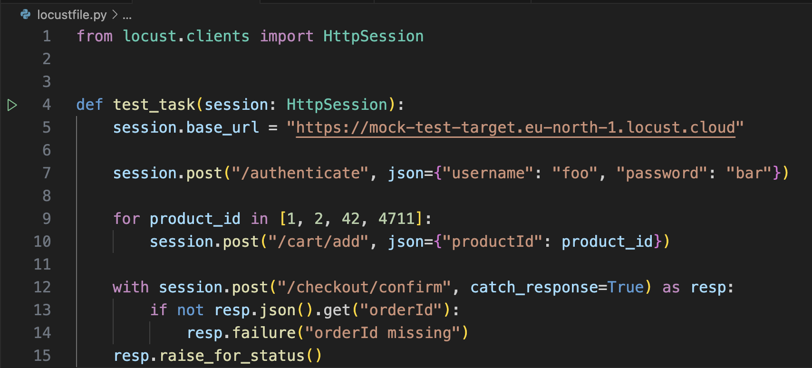

# Locust Tutorial Repo

This repo contains an example of a locustfile and VSCode settings to run it.

Open it, install the recommended plugins and install Locust using the Locust VSCode Extension's Initialize command (or manually).

You can also use VSCode's Testing feature to run or even debug pytest-style locustfiles, just click the green arrow.

